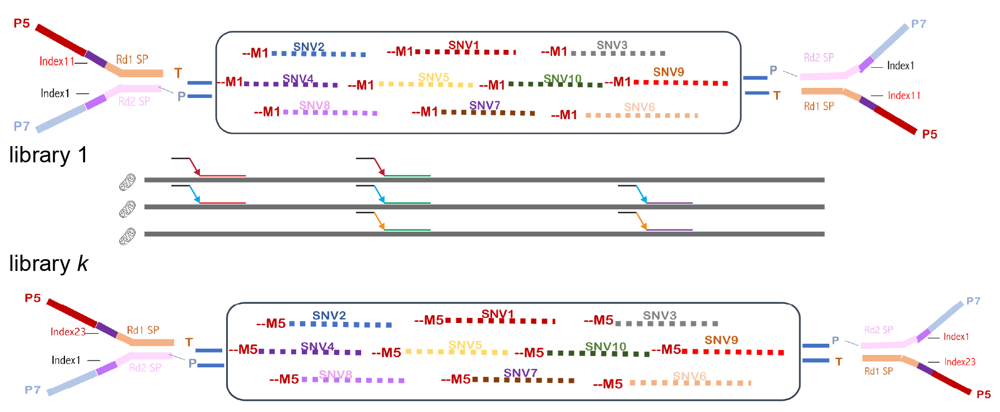

# Single-MITOchondrion Single-Nucleotide Variant (SMITO-SNV) Pipeline

## Overview
This is the computational pipeline that takes in mito-region multiplexed (Figure 1) next-generation sequencing data and outputs SNV (including indels) for each single mitochondrion for each PCR targeted region, succeeding the previous work based on micropipetting [1]. The output is a comma-delimited table containing per-base information including the position, read depth, reference base, and the frequency of variants (substitution/deletion), which is further processed so that low-Phred-score counts are removed. Insertions are also tabulated in a separated table. 




## Dependencies
* [PennSCAP-T preprocessor](https://github.com/kimpenn/ngs-smito) (>=2.3)
* GNU parallel (>=20190122)
* Perl (>=5.010), String::Approx (>3.0)
* R (>=3.5.0)
* Picard (>=2.17)
* samtools (>=1.12)

## Installation
1. Install the dependencies as listed above;
2. This package doesn't require installation to system or local `bin`. Users just need to download and place the source code folder (`Source`) to the workplace where the pipeline will be run. Make sure the `Data` folder is the same level as `Source`. If users want to use some module as standalone, they may simply source the corresponding file in bash or R environment. 

## Usage
1. Prepare the sample sheet (`Data/LibraryInfo.csv`). The format is exemplified as below,
```
$ head -n 5 Data/LibraryInfo.csv
LibraryID,ExptID,Species,MitoBarcode,SNVLoci,EndType,ReadLength
L1R61P1,777,mouse,M1;M2;M3;M4;M5;M6;M7;M8;M9;M10,v2,SE,150
L2R61P1,777,mouse,M1;M2;M3;M4;M5;M6;M7;M8;M9;M10,v2,SE,150
L3R61P1,777,mouse,M1;M2;M3;M4;M5;M6;M7;M8;M9;M10,v2,SE,150
L4R61P1,777,mouse,M1;M2;M3;M4;M5;M6;M7;M8;M9;M10,v2,SE,150
```

2. Run the pipeline to generate primer and sequencing stats as well as the pileup files by 
```
$ bash Source/release/pipeline.bash
``` 

3. Generate the SNV table for each sequencing run in R by
```
source("Source/release/pipeline.R")
```
## Copyright

Copyright (c) 2021, Youtao Lu and Junhyong Kim, Department of Biology, University of Pennsylvania

Copyright (c) 2021, James Eberwine, Perelman School of Medicine, University of Pennsylvania

Copyright (c) 2021, David Issadore, Penn Engineering, University of Pennsylvania

All Rights Reserved.

## License
[Kim Lab License](http://kim.bio.upenn.edu/software/LICENSE)

## References
1. Morris, Jacqueline, Young-Ji Na, Hua Zhu, Jae-Hee Lee, Hoa Giang, Alexandra V. Ulyanova, Gordon H. Baltuch, et al. 2017. “Pervasive Within-Mitochondrion Single-Nucleotide Variant Heteroplasmy as Revealed by Single-Mitochondrion Sequencing.” Cell Reports 21 (10): 2706–13. https://doi.org/10.1016/j.celrep.2017.11.031.
